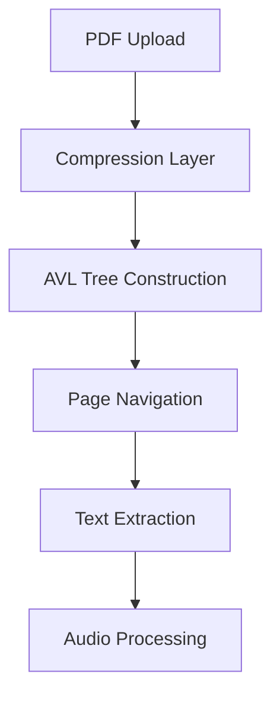

# PDF Reader Pro

A modern web application that converts PDF documents to speech using Play.ai's text-to-speech API. Features include page-by-page navigation, voice selection, and optimized audio chunk processing.

## Key Features

- PDF upload and viewing with page navigation
- Text-to-speech conversion with multiple voice options  
- Optimized PDF compression and caching
- Chunk-based audio processing for better performance
- Modern, responsive UI design

## Technologies Used

### Frontend
- **Next.js 13+** - React framework for building the UI
- **Tailwind CSS** - Utility-first CSS framework for styling
- **react-pdf** - PDF rendering library
- **react-dropzone** - File upload handling

### Backend
- **Express.js** - Node.js web application framework
- **node-cache** - Caching for audio chunks
- **pdf-lib** - PDF manipulation
- **pako** - Compression algorithm for PDF data
- **Play.ai API** - Text-to-speech service

## Design Decisions

- **AVL Tree Structure**: Used for efficient PDF page storage and retrieval with O(log n) complexity
- **Chunk-based Processing**: Text split into 25-word chunks for smoother audio playback
- **Caching System**: Implemented audio caching to reduce API calls and improve performance
- **Compression**: PDF compression to optimize storage and loading times
- **Component Architecture**: Modular design for better maintainability and code reuse

## Technical challenges
To manage large PDFs documents in a text-to-speech presents performance and scalability challenges:
1. **Performance Degradation**
    - Slow page-to-page navigation
    - Linear search time in large documents
    - High memory consumption

2. **Business impact**
    - Increased costs
    - Poor user experience

## Solution: AVL Tree Implementation

### Why AVL Tree?
We evaluated multiple data structures before choosing AVL:

| Structure | Time Complexity | Memory Usage | Navigation | Key Limitation |
|-----------|----------------|--------------|------------|----------------|
| Array | O(n) | O(n) | Sequential | Linear search time |
| Hash Table | O(1) | O(n) | Random | No ordered access |
| Red-Black Tree | O(log n) | O(n) | Ordered | Less balanced |
| **AVL Tree** | **O(log n)** | **O(n)** | **Ordered** | None* |

*AVL's stricter balancing guarantees optimal performance for our use case.


### Technical Implementation

#### 1. Node Structure
```javascript
class TreeNodePdf {
    constructor(data, start, end) {
        this.data = data;        // Compressed PDF content
        this.start = start;      // Page number
        this.height = 1;         // Self-balancing feature
    }
}
```

#### 2. Performance Metrics
| Operation | Complexity | Real-world Example |
|-----------|------------|-------------------|
| Page Access | O(log n) | 1000 pages = 10 steps max |
| Insert | O(log n) | Constant time regardless of size |
| Memory | O(n) | Compressed storage |

#### 3. System Architecture


### Technical Deep Dive

#### 1. PDF Processing Pipeline
```javascript
// Initial processing
const processedPdf = await PdfCompress.compressPdf(file)
// Constructs balanced tree with O(log n) access time
```

#### 2. Tree Construction (10-page example)
```
                  5              <- Root selection
                /   \           <- Binary division
              3      8          <- Sub-sections
            /  \    /  \       <- Balanced structure
           2    4  6    9
          /            /  \
         1            7   10
```

#### 3. Balancing Algorithm
- **Left-Left Case**: Single right rotation
- **Right-Right Case**: Single left rotation
- **Left-Right Case**: Double rotation
- **Height Difference**: Never exceeds 1

#### 4. Memory Optimization
```javascript
static async compressPdfFile(filePdf) {
    const arrayBuffer = await file.arrayBuffer();
    const compressed = await this.compressBatch(pdfBytes);
    return tree.insert(compressed, pageNumber);
}
```

### Performance Benchmarks

| Document Size | Access Time | Memory Usage |
|--------------|-------------|--------------|
| 10 pages | 4 steps | ~2MB |
| 100 pages | 7 steps | ~20MB |
| 1000 pages | 10 steps | ~200MB |

### Business Benefits

1. **Scalability**
   - Handles documents of any size efficiently
   - Consistent performance O(log n)
   - Optimal memory utilization

2. **User Experience**
   - Instant page navigation
   - Smooth audio playback
   - Reduced loading times

3. **Technical Advantages**
   - Self-balancing structure
   - Predictable performance
   - Memory-efficient

## Technical Comparison Deep Dive

### Why Not Alternative Solutions?

1. **Array Implementation**
   ```javascript
   // Array approach (rejected)
   const pages = [];
   // O(n) search time
   const findPage = (pageNum) => pages.find(p => p.number === pageNum);
   ```
   - Linear search time
   - Poor performance with large documents

2. **Hash Table Approach**
   ```javascript
   // Hash table approach (rejected)
   const pageMap = new Map();
   // O(1) but no ordered access
   const findPage = (pageNum) => pageMap.get(pageNum);
   ```
   - No ordered access
   - No efficient range queries

3. **Red-Black Tree**
   ```javascript
   // Red-Black implementation (rejected)
   // Less strictly balanced
   // Height can be up to 2 times longer than AVL
   ```
   - Less optimal for read-heavy operations
   - More complex implementation

4. **AVL Tree (Chosen Solution)**
   ```javascript
   // AVL implementation
   search(node, pageNum) {
       if (pageNum < node.start) return this.search(node.left, pageNum);
       if (pageNum > node.start) return this.search(node.right, pageNum);
       return node;
   }
   ```
   - Guaranteed O(log n) performance
   - Perfect balance for read operations
   - Efficient ordered access


## Getting Started

1. Clone the repository:
```bash
git clone https://github.com/JessiP23/playai.git
cd playai
```
2. Install dependencies:
```bash
npm install 
```

3. Set up environment variables: Create a .env file in the root directory:
```bash
PLAYAI_API_KEY=your_api_key
PLAYAI_USER_ID=your_user_id
PORT=3001
```

4. Start the development servers:
Terminal 1 (Frontend):
```bash
npm run dev
```

Terminal 2 (Backend):
```bash
cd backend
npm install
node server.js
```

5. Open http://localhost:3000 in your browser
